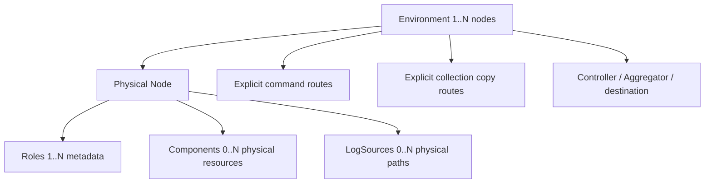
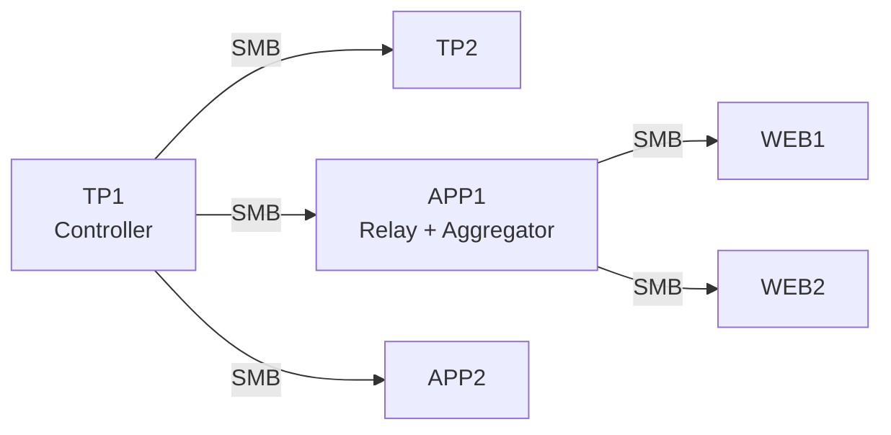
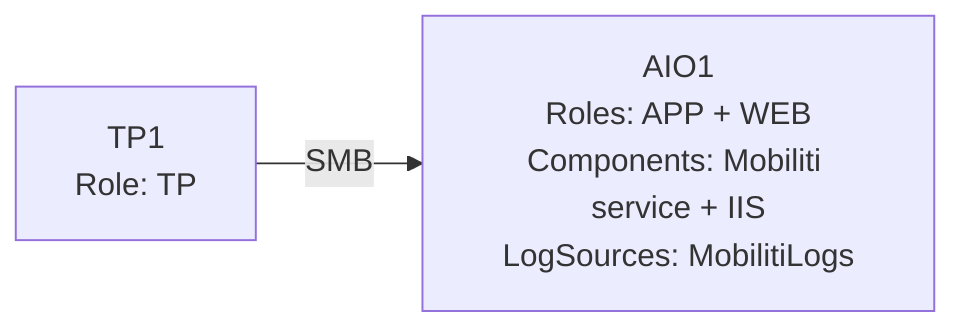
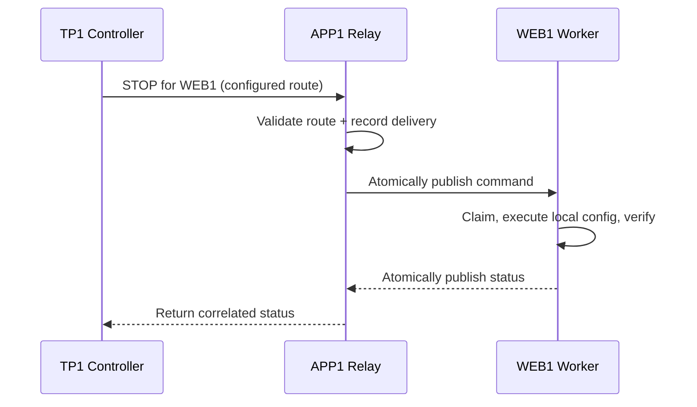
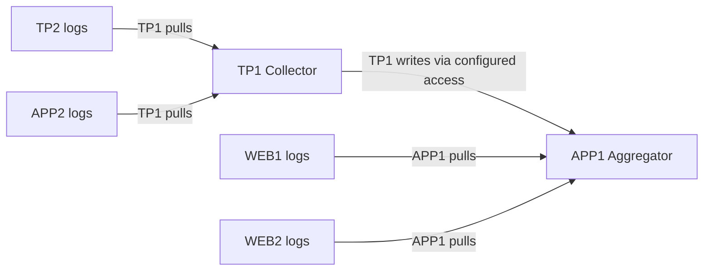
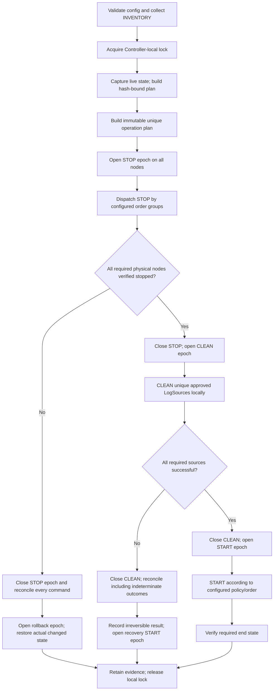
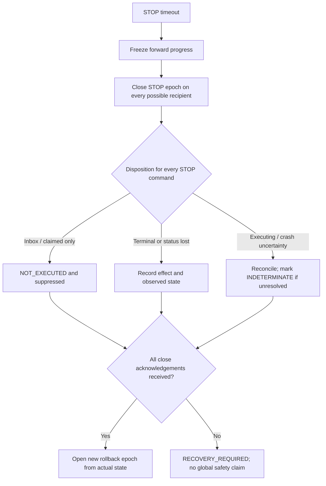
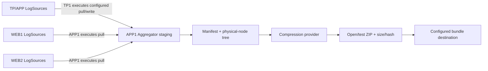

# BrainTrace architecture

## 1. Purpose and decision summary

BrainTrace will orchestrate a safe troubleshooting cycle across an arbitrary set of physical Windows nodes: establish a clean logging baseline, restore the environment for manual reproduction, collect fresh logs, and publish one traceable bundle.

The proposed version 1 architecture is a controller-coordinated, filesystem-message system over SMB. A short-lived local Worker performs privileged actions from installed allow-listed configuration. Explicit relays bridge connectivity gaps. One configurable node acts as Aggregator. No remote PowerShell execution or custom network listener is required.

The most important boundary is that orchestration messages identify **what action** a physical node should perform, never **which command, component, or path** to execute. Physical resources are installed locally and reviewed in advance.

## 2. Goals

- Support 1..N physical nodes and any role combination without code changes.
- Enforce deterministic validation and global STOP/CLEAN barriers.
- Deduplicate components and log roots by physical identity.
- Make failures, partial results, and irreversible effects explicit and inspectable.
- Use Windows PowerShell 5.1, SMB/UNC, Scheduled Tasks, and replaceable Windows-native providers.
- Provide DryRun and a local simulator using the same orchestration and protocol logic.
- Keep configuration, routing, timeouts, ordering, aggregation, and destinations out of code.

## 3. Non-goals for the initial implementation

- Real service, IIS, App Pool, deletion, remote-share, or Scheduled Task operations.
- WinRM, CredSSP, Kerberos delegation, arbitrary remote execution, or a persistent listener.
- Automatic network discovery or general-purpose route calculation.
- Automatic issue reproduction or application-specific log consistency guarantees.
- Fully transactional Prepare. Deleted logs cannot be restored.
- Credential provisioning, infrastructure ACL changes, or production deployment.
- A database, distributed consensus system, or high-availability controller.

## 4. Assumptions and trust boundaries

- SMB and NTFS are available along each configured directed connection and Windows accounts provide least-privilege access.
- Each node has a trusted local BrainTrace installation, node configuration, filesystem workspace, and eventually a Scheduled Task identity with only required local privileges.
- Clocks are synchronized well enough for expiration and diagnostics.
- Workflows are launched only on the one authoritative `ControllerNode` configured for the environment.
- Environment expectations and each node's installed effective configuration are bound by a pinned SHA-256 `ConfigHash`; `ConfigRevision` remains descriptive metadata.
- Operators understand that Prepare clears existing configured application logs and must explicitly confirm non-DryRun execution in the future UI.

SMB transport is inside the administrative trust boundary, but every message is still treated as untrusted input. ACLs, schema validation, target binding, expiration, and replay receipts provide defense in depth. Message signing is a possible future hardening measure, not a substitute for correct ACLs.

## 5. Generic environment model



The environment configuration is the Controller's expected topology, inventory hashes, command routes, and collection plans. Node-local configuration is the Worker's authority. During preflight each Worker returns an authoritative canonical inventory and SHA-256 ConfigHash. The Controller validates it against pinned expectations and uses the returned inventory to build `plan.json`; it does not send local resource definitions in mutation commands.

### Physical nodes versus roles

A node is the unit of identity, command dispatch, locking, Worker execution, state capture, and human-readable result reporting. Roles (`TP`, `APP`, `WEB`) classify workload and support validation/display; they do not own resources.

An APP+WEB server is one node. APP+WEB+TP is also one node. This avoids duplicated IIS operations and accurately models machine-level failure and state.

### QA/DEV example



This is only a configured example, not an embedded tier model.

### PDX All-in-One example



`AIO1` receives one command per phase, stops IIS once, operates the service once, and cleans/collects its one log root once.

## 6. Configuration model

Configuration has two layers:

1. **Environment configuration**: IDs, expected node roles/revisions/hashes, authoritative Controller, explicit `CommandRoutes`, explicit collection copy routes, aggregator, destination, timeouts, local-lock policy, collection and compression policies.
2. **Node-local configuration**: local node identity, roles, Worker paths, allowed cleanup roots, physical Components, physical LogSources, safety markers, and the collection-route steps that this node is authorized to execute.

This split is intentional. Central configuration describes expectations and can plan topology, while a compromised or malformed command cannot cause a Worker to touch an uninstalled resource. Deployment and every run validate `EnvironmentId`, node identity, human-readable revision, canonical inventory, and ConfigHash across both layers.

The complete QA topology is illustrated by [`config/environment.example.json`](../config/environment.example.json), and a complete APP+WEB+TP node with separate log roots is illustrated by [`config/node.example.json`](../config/node.example.json). A minimal PDX pair uses the same schemas:

The repeated-digit `ExpectedConfigHash` values in the illustrative environment file are placeholders for deployment-generated SHA-256 values, not hashes to accept in production.

```json
{
  "SchemaVersion": 1,
  "EnvironmentId": "PDX",
  "ControllerNode": "TP1",
  "AggregatorNode": "AIO1",
  "EnvironmentConfigRevision": "pdx-reviewed-1",
  "Nodes": [
    { "Name": "TP1", "Roles": ["TP"], "Inbox": "\\\\TP1\\BrainTrace$\\Inbox", "ExpectedConfigHash": "<pinned-sha256>" },
    { "Name": "AIO1", "Roles": ["APP", "WEB"], "Inbox": "\\\\AIO1\\BrainTrace$\\Inbox", "ExpectedConfigHash": "<pinned-sha256>" }
  ],
  "CommandRoutes": [
    { "Target": "TP1", "Hops": ["TP1"] },
    { "Target": "AIO1", "Hops": ["TP1", "AIO1"] }
  ]
}
```

```json
{
  "SchemaVersion": 1,
  "EnvironmentId": "PDX",
  "ConfigRevision": "pdx-reviewed-1",
  "Node": {
    "Name": "AIO1",
    "Roles": ["APP", "WEB"],
    "AllowedCleanupRoots": ["D:\\Program File\\Fiserv\\Mobiliti"],
    "Components": [
      { "Id": "MobilitiService", "Type": "WindowsService", "ResourceName": "Mobiliti", "StopOrder": 100, "StartOrder": 200 },
      { "Id": "IIS", "Type": "IIS", "ResourceName": "IIS", "StopOrder": 200, "StartOrder": 100 }
    ],
    "LogSources": [
      {
        "Id": "MobilitiLogs",
        "Path": "D:\\Program File\\Fiserv\\Mobiliti\\MTS Platform\\Logs",
        "Workloads": ["APP", "WEB"],
        "CleanupEnabled": true,
        "CollectEnabled": true
      }
    ]
  }
}
```

This PDX configuration produces one AIO1 status row, two unique component operations, and one cleanup/collection target per applicable phase.

### Worker inventory and ConfigHash

`INVENTORY` is a non-mutating preflight operation distinct from live `STATE`. It returns node roles, canonical component identities and orders, canonical LogSource paths/physical keys and flags, safety policy, collection assignments, ConfigRevision, and ConfigHash. The Controller compares this inventory to environment expectations and stores the exact response plus hash in the immutable run plan. `STATE` then records volatile component state against that inventory.

The hash uses the `BrainTraceCanonicalNodeV1` semantic JSON profile documented in [Protocol.md](Protocol.md): validated defaults are explicit; filesystem and resource identities are canonical; Unicode is NFC; object keys and set-like arrays have deterministic ordinal ordering; insignificant whitespace and source property order are removed; UTF-8 bytes without BOM are hashed using SHA-256. Volatile state and the hash field are excluded. Formatting-only JSON changes therefore do not change identity, while changes to resources, paths, order, flags, safety settings, or collection assignments do.

Every node has a pinned `ExpectedConfigHash` in environment configuration. Every phase authorization and mutation command binds the hash observed at preflight. The Worker builds an immutable effective-config snapshot and rechecks its hash at claim and immediately before each physical effect. A mismatch fails closed and starts phase reconciliation; CLEAN cannot switch from a validated path to a newly configured path.

### Component model and ordering

Each component has a stable `Id`, allow-listed `Type`, concrete `ResourceName`, integer `StopOrder`, integer `StartOrder`, and `RequiredEndState`. Physical identity is the normalized pair `(Type, ResourceName)` with type-specific case rules. Duplicate identities are rejected even when IDs differ.

Explicit integer orders are preferable to a generic dependency graph in version 1: they are easy to review, log, simulate, and override. Ties are allowed only for independent components and resolve by canonical identity for determinism. Validation should warn on suspicious ties and reject impossible constraints. Stop and start orders are independently specified rather than assuming reversal.

The examples use App Pool → service → IIS for stop and IIS → service → App Pool for start only as illustrative values. Production order and the meaning of IIS control require application-owner confirmation.

### LogSource model

A LogSource has a stable `Id`, local `Path`, optional `Workloads` metadata, separate cleanup/collection flags, and preferably a safety-marker filename. It is defined once per physical path. A node with distinct Mobiliti and SBI roots defines two sources; a node where both workloads share one directory defines one source with `Workloads: ["APP", "WEB", "TP"]`.

At validation, each path is expanded without environment-variable ambiguity, made absolute, stripped of redundant separators/trailing dots and spaces as Windows permits, resolved to its final filesystem target, and normalized case-insensitively. The physical key should use the final volume identity plus normalized relative path when available, with the final resolved path as the practical version 1 key.

Equivalent definitions are rejected rather than silently merged because different IDs, flags, or safety policies may conceal a configuration mistake. After validation, the execution plan contains one unique physical target and may retain all declared IDs only as aliases for diagnostics.

### Shared path examples

Separate TP logs on APP+WEB+TP:

```json
"LogSources": [
  { "Id": "MobilitiLogs", "Path": "D:\\Program File\\Fiserv\\Mobiliti\\MTS Platform\\Logs", "Workloads": ["APP", "WEB"] },
  { "Id": "SBILogs", "Path": "D:\\Logfiles\\Mobile\\SBILogs\\4.5", "Workloads": ["TP"] }
]
```

One shared APP+WEB+TP path:

```json
"LogSources": [
  {
    "Id": "SharedApplicationLogs",
    "Path": "D:\\Program File\\Fiserv\\Mobiliti\\MTS Platform\\Logs",
    "Workloads": ["APP", "WEB", "TP"]
  }
]
```

No role-to-path expansion occurs at runtime, so neither representation can multiply cleanup or collection.

## 7. Connectivity, routing, and responsibilities

SMB connectivity is directional. The fact that APP1 can read `\\WEB1\d$\...` says nothing about WEB1 being able to write to APP1. BrainTrace therefore models two independent concerns:

- **Command routing**: `CommandRoutes` are explicit, loop-free hop lists for small command/status files, beginning at the Controller and ending at a target Worker.
- **Collection routing**: `Collection.Routes` are explicit file-copy plans. Every step names the physical node executing the copy plus its configured read and write endpoints.

Command reachability never implies file-transfer reachability, and neither direction is inferred from the other. Validation checks known physical nodes, exact installed routes, unique command hops, maximum depth, return status paths, and every collection step from the actual executor's security context.

Automatic route finding is deliberately excluded. Explicit routes are more predictable during a production incident and expose exactly which relay account/share must work.

### Controller

The Controller validates environment expectations against Worker inventory, acquires the local environment lock, creates the run ledger, plans unique node and collection operations, opens/closes mutation phases, publishes commands, waits with deadlines, enforces barriers, reconciles abandoned phases before restoration, reports progress, and preserves evidence. It never performs remote system-control or remote deletion directly.

### Worker

A Worker validates and claims local messages, reports canonical inventory, persists phase fences, reconciles duplicates and closed phases, reads only installed node resources/collection assignments, invokes abstract local adapters, verifies final states, publishes status, and archives evidence. The eventual Scheduled Task is an execution trigger, not the source of authority.

One invocation should drain a bounded batch (for example 20 commands or 45 seconds), not exactly one command and not an unlimited queue. This handles relayed sequences more promptly while remaining bounded and compatible with one-minute polling.

### Relay

A relay validates an installed route and atomically forwards unchanged logical messages to the next configured Inbox, then returns terminal status by the reverse configured path. It keeps delivery receipts. It cannot accept a command-supplied UNC path, select a destination, skip a hop, or execute a downstream action.



### Aggregator

The Aggregator is an explicitly named node with sufficient storage and configured reachability. It owns per-run collection staging, bundle construction, compression, and initial integrity checks. Selection is operational, not role-based. Preflight validates free space, routes, write ACLs, and destination reachability.

### Collection route model

A collection route is defined per unique `(SourceNode, LogSourceId)` and has:

- `SourceNode`: the physical owner/provenance of the LogSource;
- `LogSourceId`: the canonical source returned by that node's inventory;
- `CollectorNode`: the node responsible for completing the source's route;
- `AggregatorNode`: the configured final staging owner;
- ordered `Steps`, each with `ExecutorNode`, reviewed `Read`, and reviewed `Write` endpoint.

Usually one step is sufficient: APP1 executes Robocopy, pulls WEB1, and writes to APP1's local aggregator staging. If `CollectorNode != AggregatorNode`, the collector may copy directly between endpoints when it can access both, or the route can explicitly contain pull-to-local-staging and transfer-to-aggregator steps. The model is a short reviewed plan, not automatic graph search.

Only the route ID and step number appear in a `COLLECT` command. The executor resolves them against its locally installed, ConfigHash-bound `CollectionAssignments`; paths are never supplied by the command. The environment copy plan and installed assignment must match exactly.

QA/DEV can therefore specify TP1 as executor for TP/APP sources and APP1 as executor for WEB sources:



This diagram describes copy execution, not command relays or bidirectional SMB access.

## 8. Filesystem message lifecycle

SMB file messaging is appropriate for BrainTrace because it matches known connectivity, is inspectable, avoids second-hop remoting, and fits low-volume orchestration. Its limitations—poll latency, share/ACL dependency, weak queue semantics, clock sensitivity, and crash ambiguity—are addressed with atomic same-directory publication, atomic local claims, durable receipts, phase fences, expiration, correlation, and retained evidence. It is not intended for high-throughput messaging.

The publisher creates a unique `.tmp` inside the destination Inbox, flushes/closes it, and renames it to `.command.json`. The Worker moves it on the same local volume from Inbox to Processing as the claim. It writes receipts before action, publishes terminal status atomically, then archives the command. Invalid messages go to Rejected with a safe diagnostic record.

A minute-based Scheduled Task is acceptable for the first production design if 0–60 second hop latency (and potentially more through relays) is operationally acceptable. The task should use a non-overlap mutex and bounded queue drain. Optional immediate task triggering can later reduce latency, but polling remains the reliable baseline. Required timeouts must include expected polling at every hop.

Stale Processing files are never simply returned to Inbox. Recovery first applies any pending phase closure, then consults authorization, receipt/status, ConfigHash, and actual component state. A claimed CLEAN with uncertain execution becomes an indeterminate failure requiring operator review; automatic replay is unsafe.

Full schemas and acceptance rules are defined in [Protocol.md](Protocol.md).

## 9. Run lifecycle and workspace

The Controller creates the run only after static configuration validation and before remote preflight/state capture:

```text
Runs/<EnvironmentId>/<RunId>/
  run.json                 immutable identity, workflow, config hash
  plan.json                canonical nodes, components, paths, routes
  lock-snapshots/
  inventory/<Node>.json
  phases/<Epoch>-<Name>.json
  state/<Node>.json
  commands/<CommandId>.json
  status/<CommandId>.json
  relay/
  staging/<Node>/<LogSource>/
  bundle/manifest.json
  logs/controller.jsonl
```

`run.json` progresses through an append-audited state machine such as `VALIDATING`, `CAPTURING_STATE`, `STOPPING`, `CLEANING`, `STARTING`, `COLLECTING`, `PUBLISHING`, and a terminal result. The immutable command ledger prevents a status from another run or action satisfying a barrier.

Failed and indeterminate runs retain all evidence. Successful staging cleanup is a separate retention action restricted to the exact recorded BrainTrace-owned run directory, only after bundle publication/integrity verification and a retention delay.

## 10. Environment locking

BrainTrace version 1 selects **B: one authoritative ControllerNode with a Controller-local environment lock**. All workflows for an environment must be launched on that node. A local named mutex provides live process exclusion and `D:\BrainTrace\Locks\<Environment>.lock.json` records EnvironmentId, RunId, Controller machine/process/session identity, acquisition UTC, and workflow for diagnostics.

The lock is not a renewable distributed lease and does not expire by wall clock. After a Controller crash, the OS releases the mutex; the next local invocation verifies that no owner process/mutex remains, archives the stale diagnostic file, records recovery, and acquires a new lock. A copied lock file on another machine grants no authority. If the authoritative Controller is unavailable, no new workflow starts elsewhere.

This is simpler and avoids pretending that a share lease provides split-brain safety. It satisfies v1 because configuration names exactly one Controller and operations are launched there. Multi-controller failover and distributed locking are future work requiring a different authority model. Worker phase fences—not the environment lock—prevent delayed commands from an abandoned run mutating after phase closure.

## 11. Prepare workflow



### Validation and state capture

Before mutation, BrainTrace validates schema and uniqueness, actual machine identity, pinned ConfigHash and canonical inventory, installed resource existence, component order, canonical log targets and safety markers, reparse-point policy, command routes in both directions, directional collection steps from each ExecutorNode, Worker response, required ACLs, time skew, workspace/destination capacity, timeouts, and local-lock availability.

INVENTORY first returns the authoritative effective resource model and ConfigHash. The Controller rejects differences from pinned environment expectations and saves the response in `plan.json`. STATE then captures each unique component's live state under the same hash and RunId. The plan records whether BrainTrace intends to change it. A STOP/START status reports `InitialState`, `FinalState`, and `ChangedByRun` at physical-component level.

### STOP ordering and barrier

The Controller may dispatch independent physical nodes concurrently in bounded batches. If inter-node ordering is truly required, configuration can assign nodes to simple integer `StopGroup`/`StartGroup` values; each group is a barrier. Within a node, unique components use explicit `StopOrder`. No TP/APP/WEB ordering is hardcoded.

The global STOP barrier passes only when every required physical node returns a timely, correlated SUCCESS for the open STOP epoch and the requested component state has been verified. Any rejection, failure, timeout, missing status, relay failure, or ConfigHash drift freezes forward progress. Before rollback, the Controller closes STOP on every possible recipient and reconciles every command and actual component state.

### CLEAN and barrier

Each Worker cleans the contents—not the root—of each unique, canonical, locally configured LogSource under a hash-bound CLEAN epoch. All nodes may run concurrently only after STOP is closed successfully and CLEAN is opened. The CLEAN barrier passes only when every required source reports success. Partial or indeterminate cleanup is recorded per source and is irreversible; it cannot be described as rollback and is never replayed automatically.

Even after CLEAN failure, BrainTrace attempts to restore components to the configured operational end state so the environment is not intentionally left down. The run remains failed/partially cleaned.

### START and original state

Normal successful Prepare establishes a configured operational end state, normally Running, even if a component was initially stopped; this is the stated purpose of Prepare but must be confirmed. Failure rollback is different: before CLEAN it restores only components changed by this RunId to their captured initial states.

After CLEAN begins, restoration favors the configured safe operational end state because the forward workflow has crossed an irreversible boundary. START/recovery receives a new epoch only after the prior epoch is closed and reconciled. Every deviation and failed start is surfaced. Component order uses `StartOrder`; physical identity deduplication applies again.

This distinction resolves a prompt ambiguity between “restore original state” and “restore required running state.” It must be approved before production.

### Phase fencing and late mutation reconciliation

`ExpiresUtc` is only a stale-message guard; it is not sufficient cancellation. Each STOP, CLEAN, START, and rollback phase receives a monotonically increasing epoch and random token. A Worker must acknowledge `PHASE_OPEN` and persist the expected ConfigHash before the Controller sends effects. Immediately before every physical effect, the Worker verifies the still-open `(RunId, PhaseName, Epoch, Token, ConfigHash)` authorization.

When a command times out or a phase is abandoned, the Controller freezes forward progress and sends `PHASE_CLOSE` to all nodes that received or could receive that epoch. Close is processed ahead of ordinary work and shares the node mutation mutex. The acknowledgement is emitted only after the epoch is durably closed, pending commands are suppressed, any already-running system call has returned or been classified unresolved, receipts are reconciled, and actual state is sampled.

Phase control uses a priority Control queue carried over the same explicit command routes. A persisted highest-epoch/closed record means a delayed `PHASE_OPEN` or mutation cannot reopen a closed epoch. Relays forward close controls before queued ordinary actions for the same run/target.



Required dispositions are deterministic:

- **Still in Inbox:** close suppresses it before claim; it cannot execute.
- **Processing, not executing:** the mutation mutex lets close mark it `NOT_EXECUTED`.
- **Executing:** close waits for the bounded call; no additional component effect may begin; the Worker then samples actual state.
- **Executed, status delivery failed:** durable receipt and actual state classify it `EXECUTED_STATUS_LOST`.
- **Worker crashed after STOP/START:** recovery applies close first and reconciles actual state before accepting rollback work.
- **Late STOP or START status:** retained and compared with reconciliation, but it cannot advance or reverse the Controller state machine.
- **CLEAN uncertain:** classified `INDETERMINATE`; never retried automatically. Operator resolution is required.

After a Worker acknowledges close, its durable closed-epoch record guarantees that no old command in that epoch can begin another physical effect, including after restart. If any relevant Worker cannot acknowledge, BrainTrace may restore known nodes but cannot claim rollback or the environment is complete. This deliberately prefers an honest `RECOVERY_REQUIRED` condition over false safety.

## 12. Failure handling and realistic rollback

| Failure point | Forward behavior | Recovery behavior |
|---|---|---|
| Validation/state/lock | Do not mutate | Release owned local lock; retain diagnostics |
| STOP or relay timeout | Freeze; close/reconcile STOP everywhere; never enter CLEAN | Open rollback only after close acknowledgements; restore from observed actual state |
| CLEAN partial/timeout | Close/reconcile; never replay uncertain work | Record per-source irreversible or indeterminate outcome; attempt configured operational START only after fencing |
| START partial failure | Run fails with environment degraded | Retry within bounds, verify, report exact component; operator escalation |
| Collect copy warning | Apply configured warning policy | Preserve partial staging and manifest |
| Compression/publish | Sources remain untouched | Retain staging/bundle for retry; never recopy unnecessarily without validation |
| Controller crash | Local OS mutex releases; old Worker epochs remain authoritative | Same Controller recovers run, closes/reconciles epochs, and requires operator decision for indeterminate CLEAN |

Possible rollback includes returning services/App Pools/IIS that BrainTrace changed to their captured states before CLEAN, deleting isolated incomplete staging owned by the run after retention, and retrying bundle publication. Impossible rollback includes restoring deleted application logs, making an actively changing copied file point-in-time consistent, undoing external application writes, and guaranteeing recovery from an OS or network failure.

No error is silently downgraded. Controller timeout starts reconciliation; it is not proof that an effect did not happen. A late success remains evidence but does not reopen a barrier.

## 13. Cleanup safety contract

CLEAN is permitted only if every condition below passes locally immediately before deletion:

1. The source is in installed node configuration; commands contain no path.
2. The path is absolute, local, exists, and contains no wildcard or unresolved environment variable.
3. Canonical resolution is stable and lies strictly below a configured canonical `AllowedCleanupRoot`.
4. It is not a drive root, volume mount root, share root, Worker root, run root, operating-system path, or allowed root itself.
5. It meets a configurable minimum depth and, when required, contains the expected marker file.
6. Every ancestor and child traversal obeys the reparse-point policy.
7. The target is unique in the canonical execution plan and the current effective ConfigHash still matches preflight.
8. The exact CLEAN epoch is open and the globally completed/closed STOP authorization for the same RunId is locally verifiable.

Version 1 should fail closed on any reparse point/junction/symbolic link at or below the cleanup root rather than follow or delete it. This is conservative but prevents escaping the approved tree. Deletion enumerates literal child paths, never wildcard-composed targets, does not delete the configured root or marker, logs every failure, and is bounded by time. A future explicitly reviewed policy could allow selected links.

DryRun performs all possible checks and prints canonical targets and deduplication without deleting. Because filesystem state can change, real CLEAN repeats safety validation immediately before action.

## 14. Idempotency and concurrency

STOP and START reconcile actual state, so an already-correct component is success without mutation. COLLECT writes to isolated per-run/per-source staging and can compare/resume. CLEAN is outcome-idempotent but not safely replayable under uncertainty; durable pre-execution and terminal receipts ensure a repeated `CommandId` returns its stored result.

Duplicate role membership is rejected. Duplicate physical components or canonical log paths are rejected during configuration validation rather than silently executing once under ambiguous policy. The generated plan itself contains only unique physical identities.

A node-level mutex prevents overlapping mutation effects and serializes phase closure. The Controller-local environment lock prevents Prepare and Collect from different runs overlapping. Relay delivery is at-least-once; Worker effects are effectively-once per CommandId through durable receipts, phase fences, and reconciliation, with an explicit indeterminate state after crashes.

## 15. Security and permissions

- Controller identity: read reviewed environment config; own the local environment mutex/lock and run workspace; write only first-hop Inboxes; read returned statuses.
- Relay identity: read its relay Inbox/status path and write only its configured next-hop Inbox/upstream status path.
- Worker task identity: read/write its BrainTrace queues, phase records, receipts, and operational logs; inspect/control only configured local components; execute only installed collection assignments.
- Collector identity: read/write exactly the endpoints of its installed directional collection steps.
- Aggregator identity: write its isolated staging/bundle areas and final destination; it need not be able to read every source directly.

ACLs must deny ordinary application identities write access to command queues/configuration and deny BrainTrace identities unnecessary administrative shares. No plaintext credentials are stored. Secrets are never logged. Command JSON is closed-schema data; arbitrary PowerShell and `Invoke-Expression` are prohibited.

Config files should be ACL-protected and hashed into the run plan. Optional signed configuration/messages can be evaluated after the operational trust model is known.

## 16. Logging, timeouts, and operator output

BrainTrace operational logs live outside every application LogSource. JSON Lines records include UTC timestamp, EnvironmentId, RunId, CommandId, node, roles, workflow/phase/action, component or LogSource ID, duration, result, error category, retry count, and route hop. Human-readable output summarizes one row per physical node; details remain in status/log evidence.

Every wait is bounded. Environment policy separately defines state, stop, clean, start, relay, collection, compression, publication, and poll intervals. Effective Controller deadlines account for Scheduled Task interval × hop count plus action time. Polling uses a non-busy interval with modest jitter. Retryable transport errors and terminal application errors are distinct.

## 17. Collect workflow

Collect never mutates application log sources. It creates a new locally locked run, refreshes ConfigHash-bound inventory, validates every explicit directional copy step/capacity/policy, commands each configured **ExecutorNode** to perform its installed steps, assembles the tree at the Aggregator, writes a manifest, compresses, validates, publishes, and records final integrity. The Worker on the SourceNode is not assumed to perform the copy.



This file-flow diagram is intentionally independent of the command route used to tell TP1 or APP1 to execute a step.

For every collection-enabled inventory source, preflight requires exactly one complete collection route. The route's `SourceNode`/`LogSourceId` must match the source inventory and its access path must resolve to that same canonical source from the ExecutorNode. Every step's `ExecutorNode` must report an identical installed assignment in its ConfigHash-bound inventory. Ordered steps must connect without gaps and end in the configured Aggregator's run staging. Missing, duplicate, reversed, or unreachable routes fail before copying.

### Copy provider and active files

Robocopy is a suitable default for nested, large Windows trees and resumable copying. It runs on each configured `ExecutorNode`, which may be neither SourceNode nor AggregatorNode. Use bounded `/R:n` and `/W:n`, recursive copy without `/MOVE`, `/PURGE`, or source modification, and capture its log. Exact switches require implementation review.

Robocopy exit codes are bit flags. Policy:

- `0–7`: copy operation completed without a fatal error; `1–7` carry differences/extras/mismatches and must be recorded as warnings according to their bits.
- `8` or greater: at least one copy failure; command is FAILED unless a specifically reviewed partial-collection policy says otherwise.
- unexpected/negative invocation results: FAILED.

Actively changing or exclusively locked files cannot be guaranteed point-in-time consistent. Version 1 retries within bounds, records skipped/failed/changing files in the manifest, and defaults to failing the source while preserving partial staging. An environment may opt into `ChangingFilePolicy: Warn`, producing a usable bundle visibly marked incomplete. BrainTrace does not use VSS unless separately designed.

### Bundle structure and provenance

Always include a LogSource directory, even for a single source. A uniform structure avoids future ambiguity and filename collisions:

```text
LoginFailure_20260813T194512Z/
  manifest.json
  nodes/
    AIO1/
      MobilitiLogs/
        ...
    FULLAIO1/
      MobilitiLogs/
        ...
      SBILogs/
        ...
```

The sanitized short description is limited in length, rejects empty/reserved Windows names and invalid characters, trims trailing spaces/periods, and is display metadata only. `RunId` remains the identity. If a filename already exists, publication fails rather than overwrites silently.

The manifest records environment/run/config identity, SourceNode, LogSourceId, CollectorNode, AggregatorNode, each step/ExecutorNode, physical node and canonical-source IDs (not sensitive credentials), relative files, sizes, copy outcomes/warnings, UTC times, provider/version, and hashes as configured.

### Compression and publication

Compression is an adapter (`CompressArchive` initially, optional 7-Zip later) with capability preflight, create, validate/open, and report operations. `Compress-Archive` limitations around very large files/archive size and hidden files must be tested before production; provider selection and limits are configuration-driven.

ZIP validation reopens the archive, enumerates entries against the manifest, checks expected counts/sizes, and optionally hashes entries. The completed ZIP is copied to a temporary destination filename, length and SHA-256 are compared, and it is atomically renamed to the final name when the destination filesystem supports it. SHA-256 is worth the additional read for a final troubleshooting artifact because it detects silent transfer/corruption and creates useful provenance; configuration may disable it only for measured performance reasons.

Staging is retained on compression or publication failure. Cleanup occurs only after successful verification and retention expiry, using exact recorded run-owned paths with the same root/reparse safety principles as other deletion.

## 18. DryRun and local simulation

DryRun uses real parsers, validators, canonical planners, route checks against configuration, component/path deduplication, ordering, barriers, timeouts, output, and manifests, but swaps system, transport, deletion, collection, compression, and destination adapters for no-write planners. It must never publish to production queues or modify bundles.

The simulator maps arbitrary nodes to directories under a test root:

```text
tests/simulation/scenarios/<Scenario>/
  environment.json
  nodes/<Node>/
    node.json
    Inbox/ Processing/ Status/ Archive/ Rejected/
    State/components.json
    ApplicationLogs/<LogSource>/
  expected/
```

A simulation clock and fault plan inject delayed Worker polling, phase open/close delivery, timeout, crash at every receipt boundary, relay loss, stale command, directional collection access, ConfigHash drift, copy return codes, and component failures. The same Controller/Worker cores receive filesystem and system adapters; tests do not branch on hardcoded node counts.

## 19. Testing strategy

Use Pester compatible with Windows PowerShell 5.1. Most tests run pure validation/planning functions or simulator adapters. A separate opt-in integration suite may later require a disposable Windows VM; production infrastructure is never a test target.

Required suites include:

- Configuration/topology/inventory: QA 2/2/2, production-like 6 TP plus variable APP/WEB, PDX TP+AIO, APP+WEB+TP with one shared path and with two paths, multi-role AIO inventory, shared LogSource inventory, duplicate roles/components/canonical paths, bad order, revision/hash mismatch, Worker inventory differing from environment expectations, missing/repeated nodes, invalid command routes/loops/hops/aggregator/destination.
- Cleanup safety: root/share/allowed-root rejection, traversal, wildcard, missing marker, path alias/case/trailing separator, junction/reparse escape, config change between plan/action.
- Protocol/config binding: atomic visibility, malformed/oversized/unknown-field JSON, unknown action, wrong target/version/run/phase/token/hash, expired/future command, duplicate same/different command hash, canonical-JSON test vectors, formatting-equivalent ConfigHash, stale Processing recovery, relay replay/failure/unreachable node, node ConfigHash changing after preflight and immediately before CLEAN or START.
- Prepare/late effects: all success; state timeout; STOP failure; STOP timeout with command in Inbox; STOP timeout with command claimed in Processing; STOP effect after Controller timeout but before phase close acknowledgement; STOP success with status delivery failure; Worker crash after STOP before terminal status; late STOP status during rollback; late START status; proof that rollback never completes before every relevant close acknowledgement; unreachable Worker produces `RECOVERY_REQUIRED`; CLEAN partial failure and indeterminate CLEAN outcome with proof of no automatic replay; START failure; rollback partial failure; originally stopped component; multi-role deduplication.
- Collection directionality: SourceNode different from CollectorNode; CollectorNode different from AggregatorNode; Controller unable to reach a source that its Collector can reach; collector unreachable; read succeeds/write fails; reversed SMB access rejected; missing/duplicate/gapped copy route; environment route differs from installed collector assignment; active/locked files; partial-copy policy; Robocopy `0–7` warning decoding and `8+` failure; compression/provider limits; manifest mismatch; ZIP validation; destination failure/hash mismatch; collision; safe staging retention/cleanup.
- Locking/scale: active/stale Controller-local lock, non-authoritative Controller rejection, Controller crash/recovery, clock skew for commands, bounded concurrency and polling from 2 through 10+ nodes.

Safety invariants deserve explicit negative tests, not only happy-path mocks.

## 20. Scalability

For 2 to 10+ nodes, JSON files and a single Controller remain reasonable. Commands can be dispatched concurrently per configured group with a bounded throttle; barriers use a ledger rather than serial waits. Relays add Scheduled Task latency per hop, so route depth should stay small and timeouts incorporate it. Collection can copy independent routes concurrently subject to per-Collector, network, and Aggregator throttles plus free-space preflight.

Beyond tens of nodes or deep routes, SMB polling/central staging may become operationally slow; metrics should drive any future transport change. The component/log-source model and protocol correlation remain reusable.

## 21. Repository and deployment concept

The initial repository deliberately contains only reviewable documentation/configuration. Proposed implementation structure:

```text
BrainTrace.ps1                thin CLI
BrainTrace.psd1 / .psm1       public module surface
src/Common/                   schemas, identity, logging, time, adapters
src/Controller/               planning, local lock, phase fences, barriers, run ledger
src/Worker/                   queue, validation, receipts, local execution
src/Relay/                    explicit store-and-forward transport
src/Collection/               copy, manifest, staging
src/Compression/              replaceable providers
config/                       examples only; real config stays deployment-specific
tests/Unit/ Integration/ Simulation/
scripts/Install-BrainTraceWorker.ps1   future, not yet implemented
```

A future installer may validate OS/PowerShell/prerequisites, deploy immutable code/config, create protected directories and ACLs, register a non-overlapping Scheduled Task, verify identity/config revision, and perform a simulation/self-test. It must not invent credentials.

## 22. Explicit architecture decisions and challenges

The prompt's required questions are answered concisely here:

1. **SMB messaging:** appropriate at this scale and within known connectivity, with atomic files/ACLs/receipts; not a general high-throughput queue.
2. **One-minute task:** reasonable only with accepted hop latency; retain polling and allow optional immediate triggering later.
3. **Worker batch:** drain a bounded batch/time window, not one or an unlimited queue.
4. **Queue lifecycle:** same-volume atomic publish, move-to-Processing claim, durable receipt, atomic status, then Archive; never blindly requeue stale CLEAN.
5. **Atomic publication:** create/flush/close/rename within the destination directory; local-to-share copy is not publication.
6. **Expiration:** validate at every relay and immediately before execution with bounded skew; never start expired work.
7. **Duplicates:** durable receipt keyed by CommandId plus canonical content hash; return stored terminal result or reject collisions.
8. **Multi-role components:** build operations from unique physical component identities, never roles.
9. **Shared paths:** final canonical target under Windows semantics; reject duplicate definitions and execute a unique plan.
10. **Reparse points:** fail closed at/below cleanup targets in version 1.
11. **Locks:** authoritative Controller-local mutex plus diagnostic lock file; distributed locking is unnecessary in v1.
12. **Run state:** Controller workspace, with node receipts/status copied into it; node-local evidence remains authoritative for effects.
13. **Relay:** explicit store-and-forward with unchanged identity and reverse status flow.
14. **Routing:** explicit command routes and separately explicit directional collection steps; no automatic routing in version 1.
15. **Aggregator:** explicitly configured and preflighted for reachability, ACLs, capacity, and providers; it need not access every source itself.
16. **Active logs:** no snapshot guarantee; bounded retries and manifest warnings/failures under policy.
17. **Robocopy:** appropriate default behind an adapter.
18. **Robocopy codes:** `0–7` nonfatal with decoded warnings; `8` or greater is fatal.
19. **Partial copy:** preserve staging and exact manifest; default fail, optionally publish a conspicuously incomplete bundle by policy.
20. **IIS:** do not assume `iisreset`; use reviewed Windows/IIS service semantics and WebAdministration for App Pools, with explicit verification.
21. **Ordering:** simple independent StopOrder/StartOrder on unique local components; optional node groups for true cross-node constraints.
22. **Original state:** captured per physical component with ChangedByRun in the hash-bound run ledger/status.
23. **Rollback:** first close/reconcile the abandoned epoch on every relevant Worker; then restore observed mutations before CLEAN where possible; after CLEAN, prioritize safe configured startup and disclose degradation.
24. **Irreversible:** deleted logs, external writes, and potentially inconsistent active-file copies.
25. **Staging cleanup:** only exact run-owned paths after verification and retention, with safe-root/reparse validation.
26. **ZIP integrity:** reopen/enumerate against manifest; size plus SHA-256 for final transfer by default.
27. **Scale:** bounded parallel dispatch/copy, shallow explicit routes, ledger barriers; adequate for 10+ nodes.
28. **APP+WEB:** one node, two roles, one IIS component, one service, one physical LogSource.
29. **APP+WEB+TP separate logs:** one node with three components and two LogSources.
30. **APP+WEB+TP shared logs:** one node with one LogSource whose Workloads metadata lists all roles.
31. **Components + LogSources:** sufficient when supplemented by stable physical identity, independent ordering, flags, workloads metadata, allowed roots, and revision binding.
32. **Preflight rejection:** all schema, identity, uniqueness, canonical path, safety, route, ACL, revision, capacity, provider, timeout, lock, and state-capture errors block mutation.
33. **Collection routing:** separate from command routing; every ordered copy step names its ExecutorNode and reviewed directional endpoints.
34. **Late mutations:** close and reconcile the old phase everywhere before rollback or another incompatible phase; otherwise report `RECOVERY_REQUIRED`.
35. **Controller inventory:** use Worker `INVENTORY` responses to build the plan and bind them to pinned canonical SHA-256 ConfigHashes.
36. **Environment lock:** use one authoritative Controller and a local mutex/diagnostic lock in v1; defer distributed failover.

## 23. Production questions requiring confirmation

Before any real adapter is implemented or enabled, owners must confirm:

1. The stable Windows `ServiceName` (not display name) on each relevant product/version.
2. What “IIS stopped” operationally means: WAS/W3SVC service scope, dependency behavior, acceptable impact on unrelated sites, and verification criteria. `iisreset` is not assumed.
3. Valid component StopOrder/StartOrder and whether any cross-node ordering groups are truly required.
4. Whether successful Prepare must start every `RequiredEndState: Running` component or preserve components initially stopped.
5. Exact application-log roots, ownership, marker deployment, reparse-point presence, locked-file behavior, and retention obligations.
6. Whether partial collection may publish `SUCCEEDED_WITH_WARNINGS` or must always fail.
7. Expected maximum log sizes/counts, free-space margin, ZIP64/hidden-file requirements, and the approved initial compression provider.
8. Acceptable Scheduled Task and relay latency, timeout values, clock synchronization tolerance, and maximum route depth.
9. Actual command/status SMB directions, every collection ExecutorNode's read/write shares, ACL/service accounts, and whether configured return paths work without delegation.
10. Aggregator and final destination capacity/retention, collision policy, and SHA-256 performance acceptance.
11. Required audit retention, the authorized local stale-lock recovery procedure, and who may resolve indeterminate CLEAN commands.
12. Supported Windows Server/IIS versions, PowerShell 5.1/Pester versions, and disposable integration-test environment.
13. The controlled enrollment/change process that generates, reviews, and pins each production ConfigHash.

## 24. Highest-risk future implementation areas

1. Cleanup path canonicalization and reparse-point-safe deletion.
2. Correct IIS/service dependency semantics and verified restoration after partial failure.
3. Crash recovery around an irreversible CLEAN whose terminal receipt was not written.
4. SMB ACL/routing behavior, atomicity assumptions, relay latency, phase-close delivery, and recovery of unreachable Workers.
5. Active/large-file collection, Robocopy bitmask interpretation, storage sizing, and ZIP provider limits.

## 25. Future extensions

After a simulation-first implementation and production review: signed configuration/messages, immediate Scheduled Task triggering, richer provider health checks, optional VSS-based collection, metrics dashboards, alternative compression, and a different transport if measured scale requires it. None should weaken the physical-node model, local allow-list boundary, correlation, DryRun, or barriers.

## 26. Phase 2 implementation boundary

Phase 2 implements the protocol and orchestration model with filesystem queues and adapters that are restricted to an explicitly supplied simulation root. Canonical paths use Windows absolute-path normalization within that controlled workspace; production final-volume/reparse-point identity remains the responsibility of a future reviewed filesystem adapter and must preserve `BrainTraceCanonicalNodeV1` test vectors.

The built-in simulator deliberately executes Workers synchronously so fault timing is deterministic. Persisted receipts and phase records model Inbox, Processing, effect-applied/status-lost, crash, close, and restart states. This does not weaken the architecture: a future Scheduled Task merely changes how the same Worker core is triggered.

Phase 2.5 adds an injectable UTC clock and delay scheduler for protocol expiration and simulated transport/adapter delay. Default operation still uses `UtcNow` and bounded `Start-Sleep`, but deterministic tests replace both without depending on workstation timing.

Simulation filesystem effects require strict descendant containment using a separator boundary, reject drive/share roots and prefix-confusion siblings, and fail closed on any existing reparse point at or below the target. These checks protect only the repository/test simulation adapter; they are not a production deletion adapter.

The synchronous simulator cannot prove OS scheduling behavior while one process is inside an adapter and another process observes a control file. It proves the durable state-machine outcomes around that boundary. A future disposable multi-process integration harness must validate mutex acquisition, close arrival during a real bounded adapter call, process termination between filesystem flushes, and SMB rename/visibility semantics before production adapters are considered.

The simulated compression provider implements `preflight`, `create`, `validate`, and `report` contracts as planning results. It does not create a production ZIP. The simulated copy provider copies only beneath its injected simulation root and exposes Robocopy-style outcome policy without invoking Robocopy.
