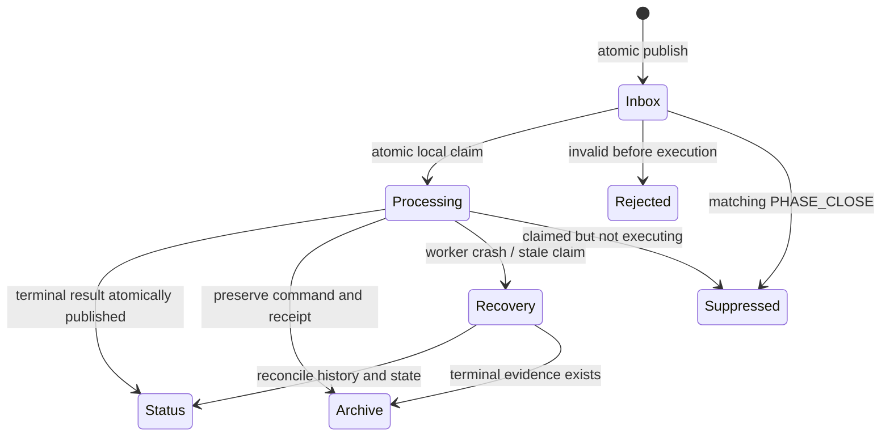

# BrainTrace filesystem protocol

## 1. Scope

Protocol version 1 is a human-readable, store-and-forward JSON protocol carried over configured SMB shares. It coordinates one command with one physical target node. It does not carry scripts, credentials, component names, filesystem paths, or arbitrary destinations.

The protocol provides correlation, expiration, atomic publication, local claiming, replay protection, and deterministic relay behavior. SMB and NTFS authentication, integrity in transit, and access control remain Windows infrastructure responsibilities.

## 2. Identity and versioning

- `ProtocolVersion` is the integer `1`. A Worker rejects unsupported versions.
- `EnvironmentId` is a case-insensitive stable identifier from installed configuration.
- `RunId` is globally unique, not merely a timestamp. Format: `<UTC timestamp>-<GUID>`, for example `20260813T191500Z-6e92a4d0-79d4-43e0-a958-7a63a26d771e`.
- `CommandId` is a new lowercase GUID for each logical target/action attempt. Retries of delivery preserve it; an operator-requested re-execution receives a new ID.
- `SourceNode` is the configured controller node.
- `TargetNode` is exactly one configured physical node. Roles never appear as targets.
- `ConfigRevision` is human-readable deployment metadata.
- `ExpectedNodeConfigHash` is the lowercase SHA-256 hash of the target's canonical effective configuration. It is the authoritative configuration binding for a run.
- `PhaseName`, `PhaseEpoch`, and `PhaseToken` bind a mutation to one explicitly authorized run phase. Epochs increase monotonically within a run and the token is a Controller-generated GUID.

IDs and node names are compared case-insensitively after schema validation. Their original spelling is retained for display.

## 3. Command schema

Required version 1 fields are shown below. `Parameters` is action-specific, closed-schema data. For the initial actions it is normally empty; notably, CLEAN cannot contain a path.

```json
{
  "ProtocolVersion": 1,
  "EnvironmentId": "QA",
  "ConfigRevision": "qa-web1-1",
  "ExpectedNodeConfigHash": "5555555555555555555555555555555555555555555555555555555555555555",
  "RunId": "20260813T191500Z-6e92a4d0-79d4-43e0-a958-7a63a26d771e",
  "CommandId": "eb7af889-f5b3-49f1-b0c6-54ab1cfda337",
  "CreatedUtc": "2026-08-13T19:15:00.000Z",
  "ExpiresUtc": "2026-08-13T19:20:00.000Z",
  "SourceNode": "TP1",
  "TargetNode": "WEB1",
  "Action": "STOP",
  "Phase": {
    "Name": "STOP",
    "Epoch": 1,
    "Token": "35c5a2b0-62f8-4be6-b7d1-4f96d997a10a"
  },
  "Parameters": {},
  "Route": {
    "Hops": ["TP1", "APP1", "WEB1"],
    "NextHopIndex": 1
  }
}
```

Validation rules:

1. Reject malformed JSON, duplicate JSON property names, unknown top-level fields, wrong types, missing fields, unsupported versions, and oversized files before claiming execution.
2. Require UTC ISO 8601 timestamps, `CreatedUtc < ExpiresUtc`, a configured maximum lifetime, and bounded clock-skew tolerance.
3. Match `EnvironmentId`, local `TargetNode`, and actual local machine identity. `INVENTORY` reports revision/hash even when they differ so the Controller can diagnose drift; all other actions enforce the expected revision/hash, except that `PHASE_CLOSE` must remain able to fence an already-open epoch after configuration drift.
4. Validate that the complete route exactly equals the installed environment route and that the receiving relay is the expected hop.
5. Require a currently open, matching phase authorization for every mutation and collection step. The Worker rechecks authorization and ConfigHash immediately before each physical effect.
6. Accept only action-specific parameter fields. No command may contain code, UNC paths, local paths, service names, executable names, or credentials. `COLLECT` may contain only a configured `CollectionRouteId` and step number.

Schema validation is necessary but not sufficient: semantic and configuration validation follows it.

## 4. Allowed actions

| Action | Meaning | Idempotency note |
|---|---|---|
| `INVENTORY` | Return canonical configured capabilities and ConfigHash | Read-only; no phase required |
| `STATE` | Inspect live state of configured components | Read-only; no phase required |
| `PHASE_OPEN` | Persist authorization for one phase epoch and hash | Control action; no system mutation |
| `PHASE_CLOSE` | Close an epoch, suppress pending work, reconcile receipts and actual state | Control action; accepted for a known run/epoch even after ordinary expiry or config drift |
| `STOP` | Stop the target's configured unique components and verify state | Already-stopped is successful with detail |
| `CLEAN` | Clear contents of configured, validated, unique log sources | Never re-execute the same `CommandId` |
| `START` | Restore/start configured components according to the run plan | Already-correct state is successful |
| `COLLECT` | Execute one installed collection-route step on the Collector/Executor node | May safely resume into isolated staging |

`STATUS` is not a Worker action in version 1: terminal status files and optional read-only progress records provide status. This removes an unnecessary command and ambiguity with the response document.

Unknown actions are `REJECTED`. Future internal actions require a new documented allow-list entry and closed parameter schema; they cannot be smuggled through `Parameters`.

## 5. Terminal status schema

Exactly one terminal status is published for each accepted or rejected command. `Details` uses a documented action-specific schema and is bounded in size.

```json
{
  "ProtocolVersion": 1,
  "EnvironmentId": "QA",
  "ConfigRevision": "qa-web1-1",
  "NodeConfigHash": "5555555555555555555555555555555555555555555555555555555555555555",
  "RunId": "20260813T191500Z-6e92a4d0-79d4-43e0-a958-7a63a26d771e",
  "CommandId": "eb7af889-f5b3-49f1-b0c6-54ab1cfda337",
  "Node": "WEB1",
  "Roles": ["WEB"],
  "Action": "STOP",
  "Phase": {
    "Name": "STOP",
    "Epoch": 1,
    "Token": "35c5a2b0-62f8-4be6-b7d1-4f96d997a10a"
  },
  "Result": "SUCCESS",
  "StartedUtc": "2026-08-13T19:15:04.120Z",
  "CompletedUtc": "2026-08-13T19:15:08.337Z",
  "Message": "All configured components reached the requested state.",
  "Details": {
    "Components": [
      {
        "Id": "IIS",
        "InitialState": "Running",
        "FinalState": "Stopped",
        "ChangedByRun": true,
        "Result": "SUCCESS"
      }
    ]
  }
}
```

Terminal `Result` values:

- `SUCCESS`: the requested invariant was verified; warnings may be present only where the action policy permits them.
- `FAILED`: execution began but the requested invariant was not achieved.
- `REJECTED`: execution did not begin because the message or configuration was invalid, unauthorized, expired, or incompatible.
- `SKIPPED`: the Controller intentionally did not request work, or a Worker had no applicable configured resources. It is not used to hide errors.
- `TIMEOUT`: synthesized by the Controller when no valid terminal status arrives by its deadline. A late Worker status is retained as evidence but cannot retroactively cross a barrier.

Collection warnings are represented as `SUCCESS` with structured warnings only if the environment policy allows a partial bundle. Otherwise they are `FAILED`. The Controller run result may therefore be `SUCCEEDED_WITH_WARNINGS` even though this is not a command result.

## 6. Filenames and directories

Names use only validated IDs and never user descriptions:

```text
Inbox/<RunId>__<CommandId>.command.json
Control/<RunId>__<CommandId>.control.json
Processing/<RunId>__<CommandId>.command.json
Archive/<yyyy-MM>/<RunId>__<CommandId>.command.json
Status/<RunId>__<CommandId>.status.json
Rejected/<RunId-or-unknown>__<CommandId-or-generated>.rejected.json
```

Temporary files append `.<publisher-guid>.tmp`. File contents, not filenames, are authoritative and must agree with the filename.

`PHASE_OPEN` and `PHASE_CLOSE` use the Control directory and are forwarded with control priority. Workers scan and claim Control before ordinary Inbox work. A durable highest-epoch record prevents a delayed `PHASE_OPEN` from reopening an epoch already recorded closed.

## 7. Atomic publication and claim lifecycle

The publisher writes a temporary file in the destination Inbox directory, flushes and closes it, then renames it to `.command.json` on the same SMB share. A rename on the same volume/directory is the publication boundary; copying from a local temporary directory is not atomic.

The Worker processes only finalized `.command.json` files:



Only one Worker instance per node may hold the Worker mutex. It claims a command by moving it from Inbox to Processing on the same volume. Failure to move means another invocation owns it.

An invocation drains a bounded batch (recommended maximum 20 commands or 45 seconds) in deterministic creation/filename order. This reduces one-minute polling latency without allowing an unbounded run. Commands from different active runs are not interleaved because the environment lock admits one workflow.

Control messages are processed before ordinary Inbox work. `PHASE_CLOSE` takes the same node mutation mutex as physical actions. After a crash, a later invocation examines stale Processing entries, the persisted phase record, receipts, terminal status, and actual state. Read-only and safely reconcilable actions can be finalized. `CLEAN` must never be blindly repeated: an `EXECUTING` receipt without a durable outcome is an operator-visible `INDETERMINATE` disposition.

## 8. Durable duplicate handling

Before an action starts, the Worker creates a durable receipt keyed by `CommandId`, containing the command hash, action, run, phase identity, target, ConfigHash, state (`CLAIMED`, `AUTHORIZED`, `EXECUTING`, `EFFECT_APPLIED`, or `TERMINAL`), and timestamps. Publication uses the same atomic-write pattern.

- Same `CommandId` and identical canonical command hash: return/re-publish the stored terminal result without executing.
- Same `CommandId` with different content: reject as an identity collision and security event.
- Duplicate delivery through a relay preserves the ID and therefore cannot duplicate the physical action.
- Processed receipts outlive command/status retention for a configured replay window that exceeds the maximum command lifetime and expected operational retry period.

The receipt is not a transaction log capable of undoing CLEAN. It is a replay guard, phase-reconciliation input, and diagnostic record.

## 9. Expiration and clock behavior

Expiration is checked both before forwarding and immediately before local execution. An expired command is `REJECTED` without system changes. A Worker also rechecks the phase authorization deadline before each physical effect. Expiration alone is not cancellation: an effect already executing may finish, so the Controller must close and reconcile the phase before rollback or any incompatible phase.

All nodes require reasonably synchronized Windows time. Deployment validation must measure skew. Version 1 uses a small configurable tolerance only for validation, never to extend a command intentionally.

## 10. Inventory and canonical ConfigHash

`INVENTORY` returns the Worker's authoritative, non-mutating effective inventory as the `Details.Inventory` payload of the normal correlated terminal-status envelope. The Controller compares it with environment expectations and stores it verbatim in `plan.json`. The payload schema is:

```json
{
  "ProtocolVersion": 1,
  "EnvironmentId": "PDX",
  "Node": "AIO1",
  "Roles": ["APP", "WEB"],
  "ConfigRevision": "pdx-reviewed-1",
  "ConfigHashAlgorithm": "BrainTraceCanonicalNodeV1+SHA256",
  "ConfigHash": "7b693f35fc075f14f91a7b47d8f1c2e1b61bb20e89785a684c08f1af18d389df",
  "Components": [
    {
      "Id": "IIS",
      "Type": "IIS",
      "CanonicalResourceName": "IIS",
      "StopOrder": 200,
      "StartOrder": 100,
      "RequiredEndState": "Running"
    },
    {
      "Id": "MobilitiService",
      "Type": "WindowsService",
      "CanonicalResourceName": "Mobiliti",
      "StopOrder": 100,
      "StartOrder": 200,
      "RequiredEndState": "Running"
    }
  ],
  "LogSources": [
    {
      "Id": "MobilitiLogs",
      "CanonicalPath": "D:\\Program File\\Fiserv\\Mobiliti\\MTS Platform\\Logs",
      "PhysicalPathKey": "volume-guid-and-relative-path",
      "Workloads": ["APP", "WEB"],
      "CleanupEnabled": true,
      "CollectEnabled": true
    }
  ],
  "CollectionAssignments": []
}
```

`BrainTraceCanonicalNodeV1` is a semantic representation, not the raw `node.json` bytes. The Worker validates and expands explicit defaults; normalizes strings to Unicode NFC; uses canonical machine, component, and final filesystem identities; sorts object keys by ordinal code point; sorts set-like arrays and inventory arrays by their documented stable keys; preserves explicitly order-significant arrays; emits integers, booleans, null, and JSON strings in a documented minimal form with no insignificant whitespace; encodes UTF-8 without BOM; and hashes those bytes with SHA-256 to lowercase hexadecimal. The hashed object includes SchemaVersion, EnvironmentId, ConfigRevision, node/machine identity, roles, Worker safety settings, allowed roots, Components, LogSources, and installed CollectionAssignments. It excludes volatile live state, timestamps, and the hash field itself.

The Phase 2.5 profile clarification is normative: Windows path identity fields are made absolute, dot segments and redundant trailing separators are removed, Unicode is normalized to NFC, and the result is uppercased invariantly before serialization. This applies to `WorkerRoot`, cleanup roots, LogSource paths/keys, and CollectionAssignment access/destination path templates. A path-template placeholder is consequently canonicalized by case as ordinary path text. JSON arrays remain arrays even when empty or containing one element. A missing `RequiredEndState` expands to `Running`; a missing or JSON-null `SafetyMarker` canonicalizes as JSON `null`. Object keys and every documented set-like collection use `StringComparer.Ordinal`, not the process culture.

The frozen compatibility vector is [`tests/fixtures/canonical-node-v1.json`](../tests/fixtures/canonical-node-v1.json). Its required SHA-256 is `47f668780f14f6d03410edaa884a3dcefe2d4316d59c976ece4f371e025d04c6`. Tests compare this literal value; they do not generate the expected digest through the implementation under test.

Equivalent JSON formatting and property order therefore produce the same hash; a semantic resource, path, order, policy, or assignment change produces a different hash. Test vectors must freeze this profile before implementation. The environment configuration pins `ExpectedConfigHash` for every node. Preflight fails if the inventory hash, revision, roles, physical identities, canonical paths, flags, order, or collection assignments differ from expectations.

The Worker remains final authority. `PHASE_OPEN` and every mutating command carry the expected hash. The Worker builds one immutable effective-config snapshot, recomputes its hash at claim and immediately before each physical effect, and rejects or stops remaining effects on mismatch. Thus a CLEAN cannot act on a path introduced after preflight.

## 11. Phase authorization, closure, and reconciliation

Each mutation phase uses a monotonically increasing `PhaseEpoch` and random `PhaseToken`. Before sending phase actions, the Controller sends `PHASE_OPEN` to every participating physical node and waits for acknowledgements bound to the RunId, phase, epoch, token, and ConfigHash. The Worker atomically persists one active phase authorization. It rejects older epochs, wrong tokens, wrong hashes, closed epochs, and commands from another run.

On timeout, failure, or abandonment, the Controller freezes forward progress and publishes `PHASE_CLOSE` through the control path to every node that received or could receive the phase. The Worker processes control before ordinary work and serializes close with the mutation mutex. Closing performs these steps atomically enough to audit:

1. persist the epoch as closed before acknowledging;
2. suppress matching commands still in Inbox;
3. mark claimed-but-not-executing commands `NOT_EXECUTED`;
4. wait for a currently executing physical call to return, without authorizing another effect;
5. reconcile receipts with actual component/log state;
6. return a close acknowledgement listing every command as `TERMINAL`, `NOT_EXECUTED`, `EXECUTED_STATUS_LOST`, or `INDETERMINATE` and include observed state.

The Controller does not declare rollback complete or open an incompatible rollback/forward phase until every relevant node has acknowledged closure and its actual state has been incorporated. A node that never observed/opened the phase returns `NOT_SEEN`, which is a valid fenced disposition after its queues and receipts are checked. If a Worker is unreachable or remains uncertain, the run is `RECOVERY_REQUIRED`; rollback may restore known nodes, but BrainTrace must not report the environment safe or finished. On reconnection, phase close is delivered before ordinary queue work so the old command is suppressed before reconciliation continues.

Case behavior:

| Command position at close | Required behavior |
|---|---|
| Inbox | Suppress/reject without execution; report `NOT_EXECUTED` |
| Processing, not executing | Close wins under mutex; report `NOT_EXECUTED` |
| Executing | Let the bounded call return, prohibit further effects, inspect actual state, then acknowledge |
| Executed, status undelivered | Receipt plus actual state yields `EXECUTED_STATUS_LOST`; late status is evidence only |
| Worker crash after STOP/START | Recovery closes epoch first and reconciles actual component state before rollback |
| Late STOP/START status | Never changes the Controller state machine; compare with close reconciliation and retain |
| CLEAN outcome uncertain | Report `INDETERMINATE`, never replay automatically, require operator resolution |

On restart, the Worker gives Control priority and then inspects existing `Processing` files before claiming ordinary Inbox work. `CLAIMED` and `AUTHORIZED` receipts may resume because the adapter boundary was not entered. `EXECUTING` is treated as uncertain and is not replayed. `EFFECT_APPLIED` is finalized from its persisted effect result and reported as `EXECUTED_STATUS_LOST`; `TERMINAL` is safely republished and archived. A CLEAN receipt at or beyond `EXECUTING` is never automatically replayed. A close that crashes after writing the closed record leaves the fence authoritative; a later duplicate close completes reconciliation without reopening the epoch.

A successful `PHASE_CLOSE` terminal status includes a bounded reconciliation payload:

```json
{
  "ClosedPhase": {
    "Name": "STOP",
    "Epoch": 1,
    "Token": "35c5a2b0-62f8-4be6-b7d1-4f96d997a10a"
  },
  "Disposition": "RECONCILED",
  "Commands": [
    {
      "CommandId": "eb7af889-f5b3-49f1-b0c6-54ab1cfda337",
      "Disposition": "EXECUTED_STATUS_LOST"
    }
  ],
  "ObservedComponents": [
    { "Id": "IIS", "State": "Stopped" }
  ],
  "IndeterminateLogSources": []
}
```

`Disposition` is `RECONCILED`, `NOT_SEEN`, or `INDETERMINATE`. The Controller validates that every command in its ledger appears exactly once across terminal statuses and close dispositions.

This is a bounded phase fence, not general distributed consensus. Its guarantee is precise: after a Worker's authenticated close acknowledgement, no command from that closed epoch can begin another physical effect. Without acknowledgements from all relevant Workers, no global safety claim is made.

## 12. Relay behavior

`CommandRoutes` are explicit ordered hop lists installed from reviewed environment configuration. The command repeats the selected command route for traceability, but it cannot define a new route.

At each hop the relay:

1. validates protocol, expiry, environment, route equality, current hop, next hop, and replay receipt;
2. atomically publishes the unchanged logical command with only `NextHopIndex` advanced;
3. records delivery evidence keyed by `CommandId` and next hop;
4. prioritizes phase-control files over ordinary action files for the same run/target;
5. retrieves the downstream terminal status through the reverse configured path and publishes it upstream unchanged.

Maximum hop count and unique hop validation prevent loops. A relay never executes a downstream command locally, accepts arbitrary UNC destinations, or rewrites target identity. Delivery retries are safe because IDs are stable.

## 13. Command routing versus collection routing

Command routing moves small protocol files through `CommandRoutes`. Collection routing moves application files and is independently configured. A `COLLECT` command targets the `ExecutorNode`/Collector for one installed route step; it contains only `CollectionRouteId` and `StepOrder`.

The executing Worker resolves that reference against its ConfigHash-bound `CollectionAssignments`, which contains the reviewed source access path, destination staging template, SourceNode, CollectorNode, and AggregatorNode. It verifies the assignment against the run plan, then runs the copy locally. `SourceNode` can differ from `CollectorNode`, and `CollectorNode` can differ from `AggregatorNode`. Ordered steps support pull-to-local-stage followed by an explicitly directed second copy when a direct source-to-aggregator copy is impossible.

No command relay hop implies file accessibility in either direction. Preflight tests every configured read and write from the actual ExecutorNode identity. Collection never reverses an SMB edge by inference and never calculates a route automatically.

## 14. Status correlation and acceptance

The Controller accepts a status only when all of these match its immutable command ledger: `ProtocolVersion`, `EnvironmentId`, `ConfigRevision`, `NodeConfigHash`, `RunId`, `CommandId`, phase identity, target physical `Node`, and `Action`. It also validates timestamps and the status schema. An old run, another node, a closed epoch, or a late timed-out response cannot satisfy the current barrier.

Status publication is atomic (`.tmp` then same-directory rename), just like command publication. Detailed operational logs may record progress, but only the terminal status file drives orchestration.

## 15. Physical-node semantics

One command targets one physical node. The Worker reads components and log sources exclusively from its installed node configuration, then:

- deduplicates components by canonical `(Type, ResourceName)` identity;
- canonicalizes log paths and deduplicates them using Windows case-insensitive path semantics;
- applies configured stop/start order to the unique component set;
- reports the physical node once, with component/log-source details nested below it.

Roles provide metadata and validation only. They never multiply commands, component operations, cleanup, collection, or status rows.

## 16. Retention and troubleshooting

Command, receipt, status, relay, and rejection evidence has configurable retention. Cleanup operates only within fixed BrainTrace-owned archive directories, never through command-provided paths. Failed and indeterminate runs receive longer retention. The run workspace maintains the authoritative controller-side command ledger and copies of all terminal evidence.
